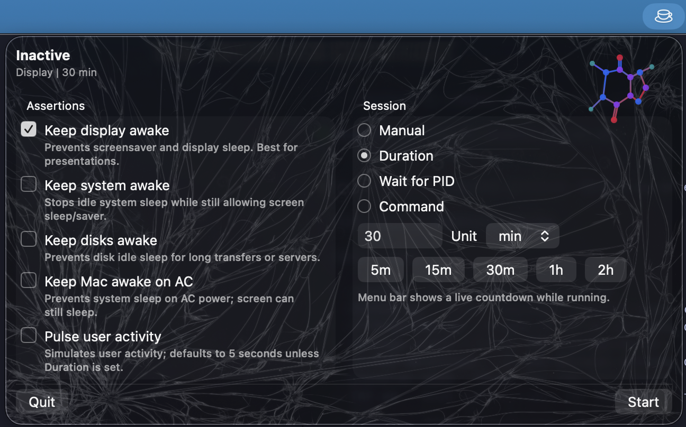
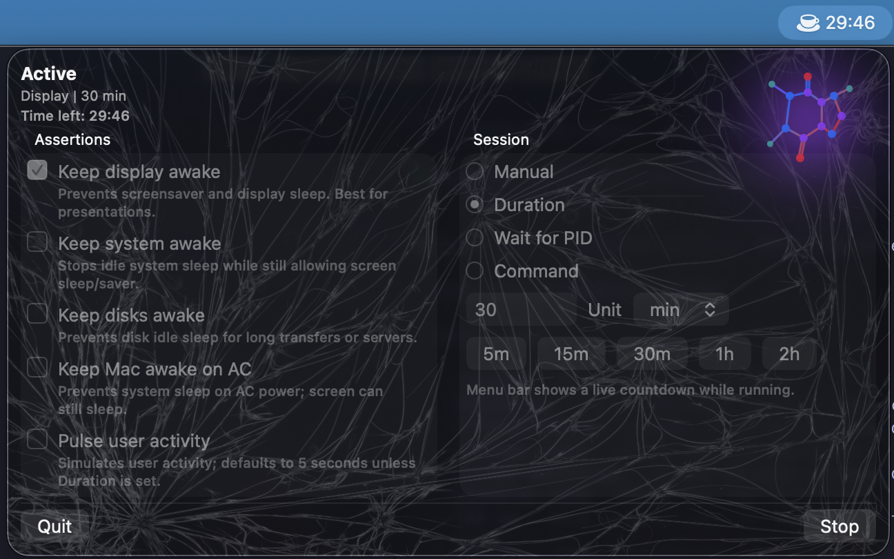

# Barista

[](https://github.com/mdsakalu/barista/actions/workflows/ci.yml)
[](https://github.com/mdsakalu/barista/releases)
[](LICENSE)
[](https://www.apple.com/macos/)

A menu bar app that wraps the built-in `/usr/bin/caffeinate` command-line utility for quick keep-awake control.

<p align="center">
  
  
</p>

## Features
- Toggle caffeinate assertions with plain-English hints.
- Session modes: Manual, Duration (with countdown), Wait for PID, Command.
- PID picker with running process names.
- Settings persist via `@AppStorage`.
- Live menu bar countdown while running a timed session.

## Requirements
- macOS 13+ (uses `MenuBarExtra`)
- Xcode 15+ recommended (for building)

## Install

### Homebrew
```bash
brew tap mdsakalu/tap
brew install --cask barista
```

### Manual
Download `Barista-macos.zip` from [Releases](https://github.com/mdsakalu/barista/releases), unzip, and drag `Barista.app` to Applications.

## Build
```
swift build -c release
scripts/package_app.sh build
```
The packaged app will be at `build/Barista.app`.

## Development
Open the package in Xcode:
```
open Package.swift
```
Select the `Barista` scheme and Run.

If you change options while running, stop and start again to apply them.

## License

MIT License - see [LICENSE](LICENSE) for details.

Background image is [CC BY-SA 3.0](https://creativecommons.org/licenses/by-sa/3.0/) - see [ATTRIBUTION.md](ATTRIBUTION.md).
